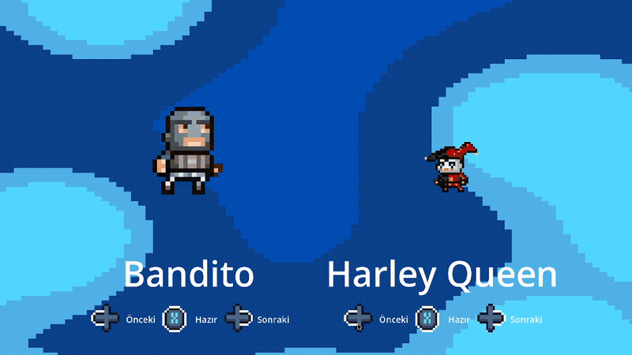
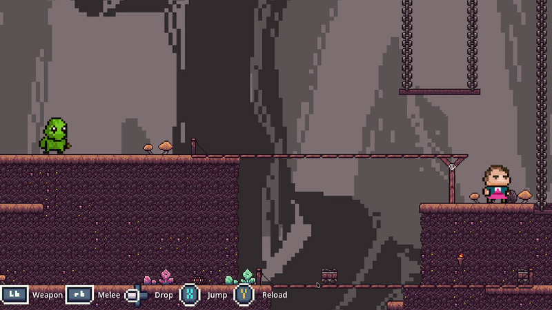
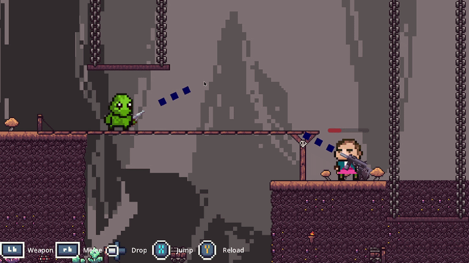
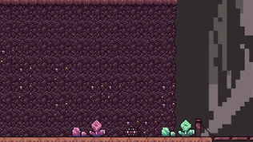

# Pojo Dojo: The Game

A rapid, co-op platformer game that designed for at least 2 controller connection that works on window, powered by Godot.

This repo is dedicated to my university club, the [Işık IEEE Student Branch](https://www.linkedin.com/company/isik-ieee).

## Features

- 15 different characters
- 10 different weapons
- 1 map

## Rules
- Every weapon has one magazine
- If magazine finished, character automaticly drops it.
- Weapons with empty magazines are extinct (get consumed) and disappears from map from a little delay.
- There's 4 weapon limit, you need to "consume" weapons to get new ones from lucky boxes.

### Character Selection Screen

### Inside The Game

### Lucky Block

